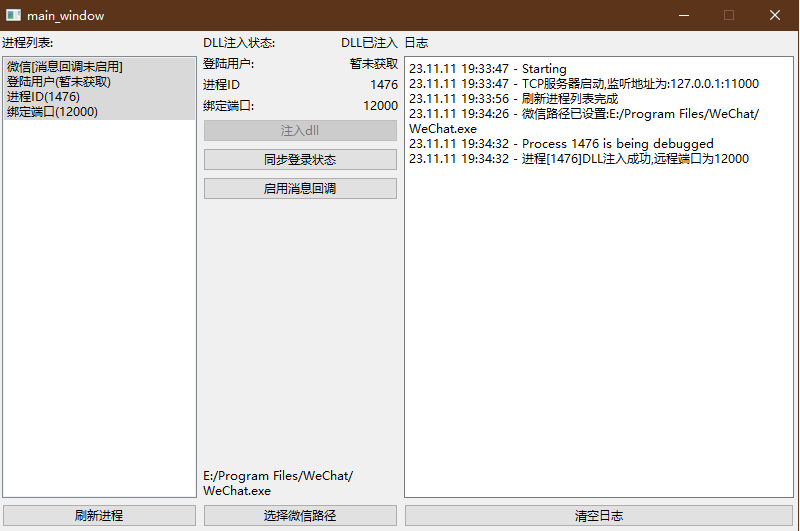

# wxhelper-demo

## 运行截图



## 使用方法

1. 安装依赖

```bash
pip install -r requirements.txt
```

复制wxhelper.dll到项目根目录, 该文件在[wxhelper项目](https://github.com/ttttupup/wxhelper)的[release](https://github.com/ttttupup/wxhelper/releases)目录下, 建议选择3.9.5.81版本

2. 运行

```bash
python main.py # 带终端窗口
或者
pythonw main.py # 仅GUI窗口
```
在界面里选择微信启动路径, 选择要处理的进程, 执行想要的操作

## 说明

1. 支持多开微信
2. 支持状态保存, 软件意外退出重启后会自动恢复上次的状态, 如每个微信进程绑定的端口,已同步的登陆用户, 是否已启用消息回调
3. 使用tcp方式与wxhelper.dll通信, 你可以在serer_and_client.py中实现自己的逻辑
